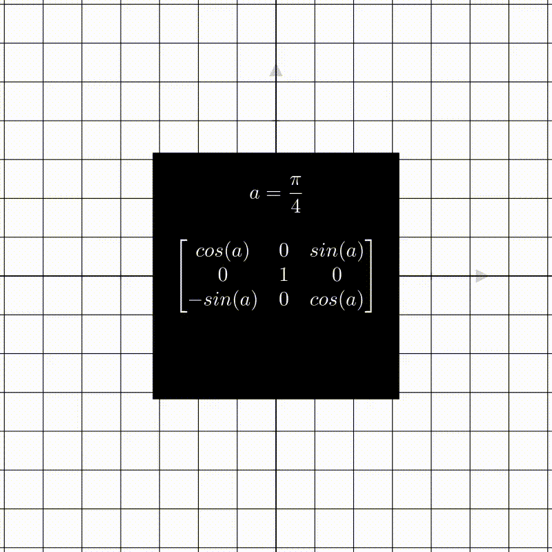
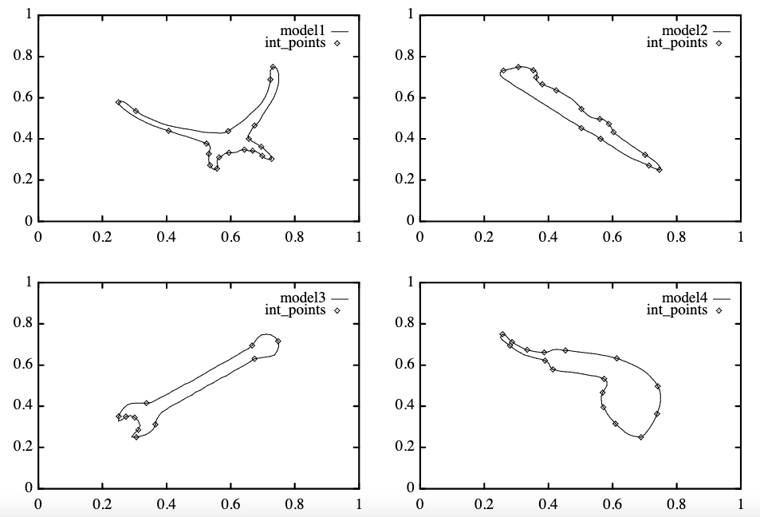

---
jupyter:
  jupytext:
    formats: ipynb,Rmd
    text_representation:
      extension: .Rmd
      format_name: rmarkdown
      format_version: '1.2'
      jupytext_version: 1.11.2
  kernelspec:
    display_name: Python 3
    language: python
    name: python3
---

# Image Registration

So far we have covered the history of deep architectures for image classification tasks, how neural architectures can be designed. We learned about how classification losses can be derived and understood and how in Similarity Learning, the objective is framed differently, in that we want to push related feature embeddings closer together and (supposedly) unrelated embeddings further apart. We went on to learn about how the task of Object Detection can be framed. 

In this chapter, we will go on to learn about yet another topic in deep learning, which is image registration. We first define the problem faced in Image Registration, which tasks we are concerned with in Image Registration and introduce the concept of transformation matrices. We will go on to examine three different approaches to Image Registration in historical order: 

- Transformation matrix estimation, 
- Iterative Registration
- Joint Detection and Description with Deep Features

## What is Image Registration?

In an Image Registration task, we want to **align images** that are taken from **different perspectives** or have **different distortions**. We generally assume that we have at least two images that depict the same objects or the same scene.

We will now give and explain some example use-cases of such an alignment of images:

<!-- #region -->
- In HDR (High Dynamic Range) photography, we're interested in increasing the dynamic range (i.e. the brightness steps) of an image by combining multiple images taken with a different aperture. Details that are blown out due to overexposure in one image can be exposed just correctly in another image. Combining these images can help having an equal amount of detail in shadows as well as close to light sources and reflections. To utilize this idea, the images must first be aligned, because we don't usually have a static scene and camera.

- In Focus stacking we want to combine images with different focuses to obtain an image in which the depth of field is maximal and everything is in focus. For this too, we need to have the images aligned.

- Similarly to stacking focus, we can use multiple images to increase the signal to noise ratio in an image (i.e. make invisible structure visible by combining multiple signals).

- In Medical imaging (e.g. MRI), images need to be aligned to facilitate comparison between different subjects or between different images of the same subject at different times.

- In panorama or 360° photography, we want to stack images taken from different angles and positions to obtain a seamless image covering a larger area. An example of this is Google Maps' Street View. We also call this process Image Stitching

- In repeat photography, we want to align historical images with contemporary images to compare how a place has changed throughout history.

- Scene reconstruction is a bit different from the previous examples in that we don't align a taken image with another image but a 3D scene with an image.

- In Motion tracking, we again have a non-static scene (objects depicted and/or camera) and estimate how much and in which direction objects or the camera have been moved. This is utilized in making actors control the movement of creatures that are rendered with some 3D software.

- Stabilizing a video taken by a non-static camera can also be interpreted as aligning images. 
  

We see that the use of image registration techniques is already pretty common (even without VR and AR technologies playing a central role in our lives).

But how do we actually align images?
<!-- #endregion -->

<!-- #region -->
## Global vs Local Transformations
Imagine yourself with two images each taken from a different perspective. One of them lays infront of you on a table the other one you hold with both of your hands. Lets also say that the image in your hands is somewhat transparent to make it easier. How would you align the image in your hands to the image on the table?
 

The first thing you might do is move the image roughly above the image on the table so that their positions somewhat match up. 
If we abstract our image into the realm of mathematics then we can think of the image as in a 2d space 
and we can interpret its movement as a shift along the x or y-axis.  
To achieve these kind of shifts we shift the whole 2d space and with it will go the image as a subset of this space. To transform our 2d space in general we can use our favourite thing, matrices. 
If you are unsure about why matrices represent transformations we recommend [this video](https://www.youtube.com/watch?v=kYB8IZa5AuE).  
The thing is that matrices will only transform our space linearly, meaning the origin will stay fixed and parallel lines will remain parallel. Parallel lines staying parallel sounds good, but to achieve a shift we will also have to move the origin. 

To adress this issue we can  switch to affine transformations 
You can think of affine transformations as doing a linear transformation but then adding a vector on top.
 

$$f(x) = Ax + b$$
 

$$\begin{pmatrix}5\\3\end{pmatrix} = \begin{bmatrix}2 & 0 \\ 0 & 2\end{bmatrix} \centerdot \begin{pmatrix}2\\1\end{pmatrix} + \begin{pmatrix}1\\1\end{pmatrix}$$

So we can transform our image linearly with *matrix* $A$ and also shift it along the x or y-axis with *vector* $b$. 
*To get the name of the transformations hover over the gifs*

For our hands on example that means we can now roughly match the positions by shifting the image and we can also do everything that keeps parallel lines parallel, think of the edges staying parallel. 
So for example we can rotate our image or squeeze or stretch it from opposing sides, given that the material allows for it. 
*The blue grid represents the old space without a transformation applied*
<table><tr>
<td>  </td>
<td>  </td>
<td>  </td> 
<td>  </td> 
</tr></table>
 

Now the question arises, is there anything that we can with the image in our hands that is not described by affine transformations. 
And the answer is yes. We can for example tilt the image to the right. From a 2d point of view, the left side of the image grows larger while the right side gets smaller. This kind of transformation cannot be expressed by an affine transformation in two dimensions.  

If we also want to mathematically express tilts without bothering with any more complex transformations we can just switch to 3 dimensions. In 3d a tilt is nothing but a rotation.  
Going 3d has another benefit. If you look at top side of the sheared square you can see how it is shifting. So what what if we shear a cube in 3d and imagine the top side as our image ... *drumroll*... We just shifted/translated our image with a **linear** transformation without having to add any vector.

 

So in essence, if we go 3 dimensional and place our image at $z=1$ (top of square) then we can achieve  
affine and projective (tilting) transformations from a 2 dimensional perspective with just linear transformations (simple matrix). 
(*"from a 2 dimensional perspective"* ~ meaning we project our image back to 2 dimensions after the transformation)
 
 

If you want further illustrations you can check out [this video](https://www.youtube.com/watch?v=E3Phj6J287o)
 

Below is some math to elaborate how we "go" into 3d and thus integrate the "added vector" into the matrix

$$\mathbf{y} = A \mathbf{x} + \mathbf{b}$$

$$\begin{bmatrix} \mathbf{y} \\ 1 \end{bmatrix}
= \left[ \begin{array}{ccc|c} & A & & \mathbf{b} \\ 0 & \cdots & 0 & 1 \end{array} \right]
\begin{bmatrix} \mathbf{x} \\ 1 \end{bmatrix}$$

Coming back to the title of this section, **Global vs Local Transformations**, everything we did so far we applied to the whole image or in fact to the whole 2d plane. This is why we call all these transformations **Global**.  
In **Rigid Registration** we assume that we can align images with a Global transformation.

This stands in contrast to **Non-Rigid Image Registration** where assume that a **local** distortion has taken place. This might be useful for un-distorting pictures taken with a lens that has a distortion, but in this chapter we will focus enterily on **Rigid Image Registration**.

### With all this linear algebra out of the way we can finally jump into the first approach.
<!-- #endregion -->

<!-- #region -->
# Approach 1: Estimating the Transformation Matrix

This approach is all about using a Single Layer Neural Network (SL-NN) to predict **parameters** of **affine transformations** in 2 dimensions. 
Because we restrict ourselves to affine transformations that also means that we assume that the planar object that we want to align is not tilted like we saw in the previous gif.

$$A = \begin{bmatrix}a_{11} & a_{21} \\ a_{12} & a_{22}\end{bmatrix} \quad and \quad b = \begin{pmatrix}b_1\\b_2\end{pmatrix}$$

The prediction is based on image coordinates of the points in a transformed view or perspective. 
Note that we dont give the network any information about the original view of our planar object. If you are now wondering how the network would then be able to predict the affine transformation that would align two yet unseen images, then you are right to wonder, because in this approach we always train with the same original image that is then transformed into many new views from which the network has to predict the respective transformations. 

After training the network should be able to generalize, that is predict the parameters of the transformation for an image in an unknown view.

### Procedure
The first thing we do is choose a model, but not model as in neural network but as in mould or object.
This model represents our original image from which we generate new views.

Before we generate new views based on affine transformations we define the possible ranges of values for the parameters that constitute the transformation.

In the next step we sample affine transformations according to the previously defined parameter ranges. These transformations will then be applied to the known view, our original image or model. The result are transformed views which are then used to train the Single Layer Neural Network.

The input is not the transformed images themselves but coordinates of points in the transformed images. Points like the *int_points* in the illustration above.

The loss is calculated based on the predicted and true parameters using the sum of squared errors

One important detail about the architecture is that they split the coordinates of the transformed points into x and y values which reduced the time to generate the transformed views significantly and also reduced the network size by half. *(This was in 1999, when hardware limitation were still a concern)*

### PCA
Principle component analysis is applied to the inputs of the network in order to reduce the dimensionality.

### Testing
To test the models performance they compared the outputed transformation parameters directly to the true parameters and also compared the original image with the true transformation applied to the original image with the predicted transformation applied.
<!-- #endregion -->