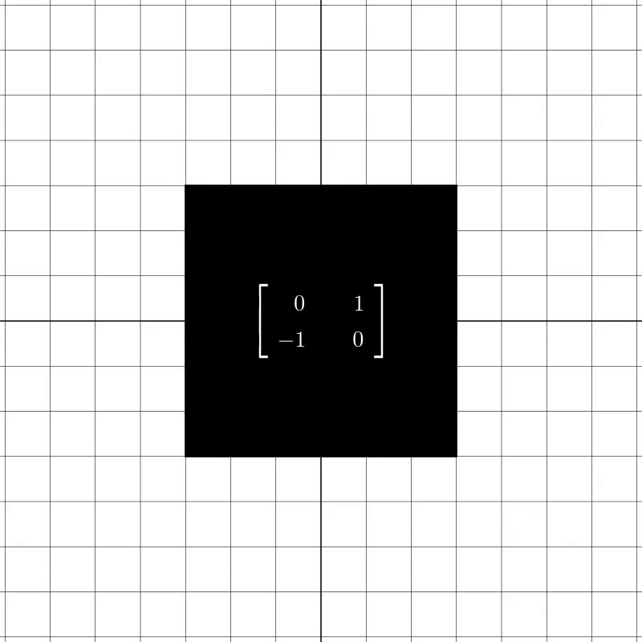

---
jupyter:
  jupytext:
    formats: ipynb,Rmd
    text_representation:
      extension: .Rmd
      format_name: rmarkdown
      format_version: '1.2'
      jupytext_version: 1.11.2
  kernelspec:
    display_name: Python 3
    language: python
    name: python3
---

# Image Registration


So far we have covered the history of deep architectures for image classification tasks, how neural architectures can be designed. We learned about how classification losses can be derived and understood and how in Similarity Learning, the objective is framed differently, in that we want to push related feature embeddings closer together and (supposedly) unrelated embeddings further apart. We went on to learn about how the task of Object Detection can be framed. 

In this chapter, we will go on to learn about yet another topic in deep learning, which is image registration. We first define the problem faced in Image Registration, which tasks we are concerned with in Image Registration and introduce the concept of transformation matrices. We will go on to examine three different approaches to Image Registration in historical order: 

- Transformation matrix estimation, 
- Iterative Registration
- Joint Detection and Description with Deep Features


# What is Image Registration?

In an Image Registration task, we want to **align images** that are taken from a different perspective or have different distortions. We generally assume that we have at least two images that depict the same objects or the same scene. 

We will now give and explain some example use-cases of such an alignment of images:

<!-- #region -->
- In HDR photography, we're interested in increasing the dynamic range (i.e. the brightness steps) of an image by combining multiple images taken with a different apperture. Details that are blown out due to overexposure in one image can be exposed just correctly in another image. Combining these images can help having an equal amount of detail in shadows as well as close to light sources and reflections. To utilize this idea, the images must first be aligned, because we don't usually have a static scene and camera.


- In Focus stacking we want to combine images with different focus to obtain an image in which the depth of field is maximal and everything is in focus. For this too, we need to have the images aligned.


- Similarly to stacking focus, we can use multiple images to increase the signal to noise ratio in an image (i.e. make invisible structure visible by combining multiple signals).


- In Medical imaging (e.g. MRI), images need to be aligned to facilitate comparison between different subjects or between different images of the same subject at different times.


- In panorama or 360° photography, we want to stack images taken from different angles and positions to obtain a seamless image covering a larger area. An example of this is Google Maps' Street View.


- In repeat photography, we want to align historical images with contemporary images to compare how a place has changed throughout history.

- Scene reconstruction is a bit different from the previous examples in that we don't align a taken image with another image but a 3D scene with an image.


- In Motion tracking, we again have a non-static scene (objects depicted and/or camera) and estimate how much and in which direction objects or the camera have been moved. This is utilized in making actors control the movement of creatures that are rendered with some 3D software.


- Stabilizing a video taken by a non-static camera can also be interpreted as aligning images. 


We see that the use of image registration techniques is already pretty common (even without VR and AR technologies playing a central role in our lives).


In the following section we will inquire about the notion of global transformation matrices, that are needed to transform an image in order to align it with another image.
<!-- #endregion -->

# Global Transformation Matrices

When aligning two images in Image Registration, we assume that one image is a transformed version of the other image. 

In *rigid* registration we assume that the transformation can be described by a global transformation (comprising rotation, translation as well as affine or projective transformations). *Non-rigid* Image Registration on the other hand does not assume a global transformation having taken place but a local distortion. This might be useful for un-distorting pictures taken with a lens that has a distortion but in this chapter we will focus on rigid Image Registration.

A global transformation in rigid Registration can be described by a transformation matrix. This also brings us to the first historical approach to image registration.

<!-- #region -->
# Approach 1

To understand the first approach, we must understand how an image can be rotated, translated, projected, sheared, scaled etc. with transformation matrices. For this purpose, we give two examples for rotation and translation and provide a link to resources about other transformations.

Affine transformations have the property of preserving lines and their parallelity. Translation, scaling, homothety, similarity, reflection, rotation, shear mapping, and compositions of them in any combination and sequence belong to affine transformations.

While affine transformations preserve parallel lines, projective transformations in projective geometry do not preserve parallel lines. Projective transformations can be best thought of as changing the perspective/viewpoint.

"Approach 1" is concerned with learning affine transformations.

### example 1: translation
An example for translation, another example for rotation and another one for projective transformation (slide 55, but in LaTeX with nice matrix representation and two images)


### example 2: rotation

- x
<!-- #endregion -->
### Gifs



```{python}

```
