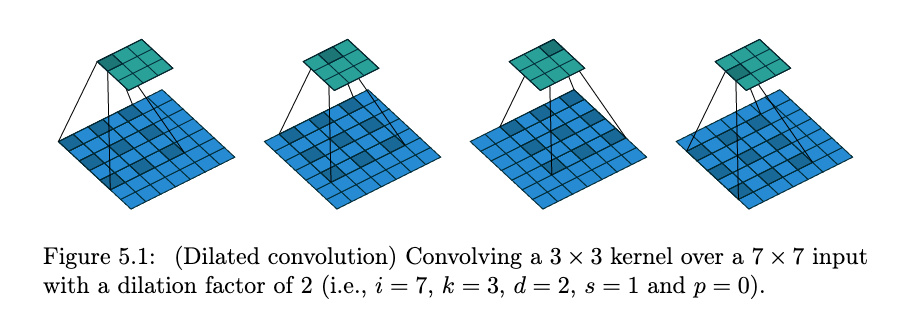

---
jupyter:
  jupytext:
    text_representation:
      extension: .Rmd
      format_name: rmarkdown
      format_version: '1.2'
      jupytext_version: 1.11.2
  kernelspec:
    display_name: Python 3
    language: python
    name: python3
---

# Week07: Deep Image Registration
#### Besed on lecture given by: Axel Schaffland

## Content
(can be completed in the end)

## 3. Deep features: Detect-and-Describe

From object detection lectures, we learned that for models in the R-CNN family, the detection consists of two stages: (1) first, the model proposes a set of regions of interests by selecting search or regional proposal network. The proposed regions are sparse as the potential bounding box candidates can be infinite. (2) Then a classifier only processes the region candidates ([Lil'log](https://lilianweng.github.io/lil-log/2018/12/27/object-detection-part-4.html)).

Similarly, *detect-then-describe* method first applies a feature detector to identify a set of keypoints, which then provides image patches extracted around the keypoints for feature description. 

According to [Dusmanu and colleagues](https://arxiv.org/abs/1905.03561), the limitation of *detect-then-describe* is the lack of repeatability in the keypoint detector: while local descriptors consider larger patches and potentially encode higher-level structures, the keypoint detector only considers small image regions. As a result, the detections are unstable under strong appearance changes. This is due to the fact that the low-level information used by the detectors is often significantly more affected by changes in lowlevel image statistics such as pixel intensities.

This motivates the work of *detect-and-describe* as introduced in the [D-2 Net paper](https://arxiv.org/abs/1905.03561). 

<td>  </td> 

The central idea is to first use CNN to compute a set of feature maps, which are then used to compute the descriptors (as slices through all maps at a specific pixel position) and to detect keypoints (as local maxima of the feature maps). Unlike approach 1 and 2 whose goal is to learn the underlying transformation matrix, the task here is to establish pixel-level correspondences.

<!-- #region -->
### 3.1 Joint Detection and Description Pipeline

The ***detect-and-describe*** proposes a joint detection and description pipeline (as opposed to two-stage pipeline in *detect-then-describe*). In other words, all parameters are shared between detection and description and a joint formulation that simultaneously optimizes for both tasks is used. Because both detector and descriptor share the underlying representation, this approach is referred to as D2.

<td>  </td> 

Before feature description and detection, **the fist step** in the pipeline is to apply a feature extraction CNN $\mathcal{F}$ on the input image $I$ to obtain a 3D tensor $F$ = $\mathcal{F}($I$)$; $F$ $\in$ $\mathbb{R}^{h×w×n}$, where $h×w$ is the spatial resolution of the feature maps and $n$ the number of channels. 

In the context of ***feature description***, the 3D tensor $F$ could be interpreted as a dense set of descriptor vectors $\mathbf{d}$. As indicated above in Figure 2 (b) and Figure 3 - left image, each $\mathbf{d}$ is the **blue cube** at each $ixj$ position/pixel across all channels. The mathematical definition of $\mathbf{d}$ is $\mathbf{d}_{ij} = F_{ij:}, \mathbf{d} \in \mathbb{R}^{n} (i = 1,...,h; j = 1,...,w)$.

After L2 normalization, these descriptor vectors could be readily compared between images to establish correspondences using Euclidean distance. ($\mathbf{\hat{d}}_{ij} = \mathbf{d}_{ij}/\lVert d \rVert_2$) 
<!-- #endregion -->

<!-- #region -->
### INTERNAL notes:
Discussion during previous meeting: Neural Networks are used to obtain deep features (instead of classical features). Then traditional methods are used to match features on paired images.

Not learning transformatoin matrix, but to match points of paired image.

<!-- #endregion -->

#### 3.1.1 Feature Detection

After knowing what the feature descriptors are, we would like to know how ***feature detection*** works. 

Through the lense of feature detection, the 3D tensor $F$ could be interpreted as a collection of 2D responses $D$: $$D^{k} = F_{::k}, D^{k} \in \mathbb{R}^{hxw} (k = 1, ..., n)$$ 

The feature extraction function $\mathbb{F}$ could be thought of as $n$ different feature detector functions $D^{k}$, each producing a 2D feature map (or detection map as named in the original paper) $D^{k}$. In Figure 3 - left image, $D^{k}$ is pointed out. A detection can take place on any of the response maps. 

If only a subset of locations are selected as the output keypoints, what are the restrictions to detect a point $(i, j)$?

**Hard Feature Detection**

In plain words, for a point $(i,j)$ to be detected, we first look at $(i,j)$ position across all channels(i.e. the blue cube) to identify the max $D_{ij}$ at the channel $k$ (i.e. $D^{k}_{ij}$). This is called ***channel selection*** in the original paper. Then we need to check if $D^{k}_{ij}$ is also the max compared to its nearest neighbors (i.e. ***local maximum***; 9 neighbors of pixel $(i,j)$ are used in the original paper). 

In other words, $D^{k}_{ij}$ are bounded by the criteria in both $hxw$ direction and channel direction.

However, the hard features don't allow back-propagation for training. Therefore, as the next step, the hard detection procedures is softened to enable back-propagation.

**Soft Feature Detection**

The goal here is to take the criteria in both $hxw$ direction and channel direction into account and generate a soft detection score $s_{ij}$ for training.

Step 1: compute a soft local-max. score $\alpha$ (i.e **soft-NMS** in Figure 3 - right image):
$$\alpha_{i j}^{k}=\frac{\exp \left(D_{i j}^{k}\right)}{\sum{\left(i^{\prime}, j^{\prime}\right) \in \mathcal{N}(i, j)} \exp \left(D_{i^{\prime} j^{\prime}}^{k}\right)}$$

where $\mathcal{N}(i, j)$ is the set of 9 neighbours of the pixel $(i; j)$ (including itself).

Step 2: define soft channel selection that gives ratio-to-max score $\beta$:
$$\beta_{ij}^{k}=D_{ij}^{k} / \max {t} D_{ij}^{t}$$

Step 3: to take both criteria into account, we maximize the product of both scores across all feature maps k to
obtain a single score map:
$$\gamma_{ij}=\max_{k}\left(\alpha_{ij}^{k} \beta_{ij}^{k}\right)$$

Step 4: finally, the soft detection score $s_{ij}$ at a pixel $(i,j)$ is obtained by performing an image-level normalization:
$$s_{ij}=\gamma_{ij} / \sum_{\left(i^{\prime}, j^{\prime}\right)} \gamma{i^{\prime} j^{\prime}}$$

#### 3.1.2 Scale invariance - Image Pyramid (during *test time*)
Although CNN descriptors have a certain degree of scale invariance due to pre-training with data augmentations, they *are not* inherently invariant to scale changes and the matching tends to fail in cases with a significant difference in viewpoint.

An image pyramid is proposed to be used during testing. 

Briefly speaking, given an input image $I$, three different resolutions (half resolution, input resolution, and double resolution) is applied to $I$ and feature maps at those three resolutions are extracted using those three variants of $I$.

Since the intuition is also introduced in object detection, we recommend you to check out the paper for the exact operations.

#### 3.1.3 Subpixel accuracy

This has little to do with deep learning. For details, we would like to recommend you to check out the original paper.

### 3.2 Jointly Optimizing Detection and Description

#### 3.2.1 Training Loss

To jointly optimizes the detection and description objectives using a single CNN $\mathcal{F}$, we need an appropriate loss $\mathcal{L}$.

The loss $\mathcal{L}$ needs to address the following two objectives: 
1. for detection, we want keypoints to be repeatable under changes in viewpoint or illumination.  
2. for description, we want descriptors to be distinctive, so that they are not mismatched. 

An extension of triplet margin ranking loss is used, which has two anchors and consider two directions (as opposed to one anchor and considering only one direction as we learned previously).

Suppose we have a pair of images $(I_1, I_2)$ and a correspondence $c : A \leftrightarrow B (A \in I_1, B \in I_2)$. The extended triplet margin ranking loss seeks to minimize the distance of the corresponding descriptors (ground truth) $\mathbf{\hat{d}}^{(1)}_{A}$ and $\mathbf{\hat{d}}^{(1)}_{B}$, while maximizing the distance to other confounding descriptors $\mathbf{\hat{d}}^{(1)}_{N_1}$ and $\mathbf{\hat{d}}^{(1)}_{N_2}$ in either images.

Using what we learned before, we could understand $\mathbf{\hat{d}}^{(1)}_{N_1}$ as the hardest negative case similar to $\mathbf{\hat{d}}^{(1)}_{A}$ and $\mathbf{\hat{d}}^{(1)}_{N_2}$ similar to $\mathbf{\hat{d}}^{(1)}_{B}$. One thing new is that they need to lie outside of a square local neighbourhood
of the correct correspondence:

$$N_{1}=\underset{P \in I_{1}}{\arg \min }\lVert \hat{\mathbf{d}}_{P}^{(1)}-\hat{\mathbf{d}}_{B}^{(2)}\rVert_{2} \text { s.t. }\lVert P-A \rVert_{\infty}>K$$

and similarly for $N_2$.

<td>  </td> 

Step 1: define ***positive* descriptor distance $p(c)$** between the
corresponding descriptors $\mathbf{\hat{d}}^{(1)}_{A}$ and $\mathbf{\hat{d}}^{(1)}_{B}$:

$$p(c)=\lVert\hat{\mathbf{d}}_{A}^{(1)}-\hat{\mathbf{d}}_{B}^{(2)}\rVert_{2}$$

Step 2: define ***negative* descriptor distance $p(c)$** which accounts for the most
confounding descriptor for either $\mathbf{\hat{d}}^{(1)}_{A}$ or $\mathbf{\hat{d}}^{(1)}_{B}$:

$$n(c)=\min \left(\lVert \hat{\mathbf{d}}_{A}^{(1)}-\hat{\mathbf{d}}_{N_{2}}^{(2)}\rVert{2},\lVert \hat{\mathbf{d}}_{N_{1}}^{(1)}-\hat{\mathbf{d}}_{B}^{(2)}\rVert_{2}\right)$$

Step 3: The ***triplet margin ranking loss*** for a margin $M$ can be then defined as:

$$m(c)=\max \left(0, M+p(c)^{2}-n(c)^{2}\right)$$

An intuitive way of understanding this loss: it seeks to enforce the distinctiveness of descriptors by penalizing any confounding descriptor that would lead to a wrong match assignment. 

Step 4: to ensure *repeatability* of detections, an detection term is added to the triplet margin ranking loss:

$$\mathcal{L}\left(I_{1}, I_{2}\right)=\sum_{c \in \mathcal{C}} \frac{s_{c}^{(1)} s_{c}^{(2)}}{\sum_{q \in \mathcal{C}} s_{q}^{(1)} s_{q}^{(2)}} m(p(c), n(c)) =\sum_{c \in \mathcal{C}} \frac{s_{c}^{(1)} s_{c}^{(2)}}{\sum_{q \in \mathcal{C}} s_{q}^{(1)} s_{q}^{(2)}} m(c)$$

Here, $s_{c}^{(1)}$ and $s_{c}^{(2)}$ are the soft detection scores at points $A$ and $B$ in $I_1$ and $I_2$ respectively. $\mathcal{C}$ is the set of all correspondence between $I_1$ and $I_2$.

We could understand $\mathcal{L}$ as a weighted average of the margin terms $m$ over all matches based on their detection scores. Thus, in order for the loss to be minimized, the most distinctive correspondences (with a low margin term $m$) will get higher soft detection scores; descriptors that are not very distinctive (i.e. larger $m(c)$) are encouraged to have a smaller soft detection score.

### 3.3 Network Architecture

The VGG16 architecture, pretrained on ImageNet and truncated after the conv4 3 layer, was used
to initialize the feature extraction network $\mathcal{F}$.

<td>  </td> 

As highlighted in yellow, during testing, in order to increase the resolution of the feature maps, the last pooling layer (pool3) from $\mathcal{F}$ with a stride of 2 is replaced by an average pooling layer with a stride of 1.

Then the subsequent convolutional layers (conv4_1 to conv4_3) are replaced with **dilated convolutions with a rate of 2**, so that their receptive field remains unchanged. With these modifications, the obtained feature maps have a resolution of one fourth of the input resolution, which allows for more tentative keypoints and a better localization.

#### 3.3.1  Dilated Convolution
In dilated convolution we dilate or spread out our kernel to increase the receptive field without increasing our parameter count.
[Image Reference](https://arxiv.org/pdf/1603.07285.pdf)

### 3.4 Dataset - MegaDepth Dataset 

To generate training data on the level of pixel-wise correspondences, [the MegaDepth dataset](https://www.cs.cornell.edu/projects/megadepth/) is used, which consists of 196 different scenes reconstructed from 1,070,468 internet photos using COLMAP.

To extract the correspondences, the authors use depth information to obtain image pairs and key point correspondences for training.

Here is an example of the MegaDepth Dataset. 
(The images at the bottom row are depth maps, indicating the distance to the camera. Black is sky and the value is infinite.)

<td>  </td> 

### 3.5 Results of D2-Net

Here are examples of correctly matched image pairs from the [Aachen Day-Night dataset](https://www.visuallocalization.net/datasets/) by D2-Net method:

<td>  </td> 

Below is an evaluation on the Aachen Day-Night dataset. On the $X$-axis, the distance threshold and orientation threshold refer to how far off the model's predictions are from the actual camera position/angle.

<td>  </td> 

### Conclusion/Take-home message
From the previous lectures to the current one, we have observed the trend of using single-stage model instead of multistage models. The intuition behind improved performance is that the detection is not done on low-level image structures but postponed until more reliable information is available, and done jointly with the image description. 

