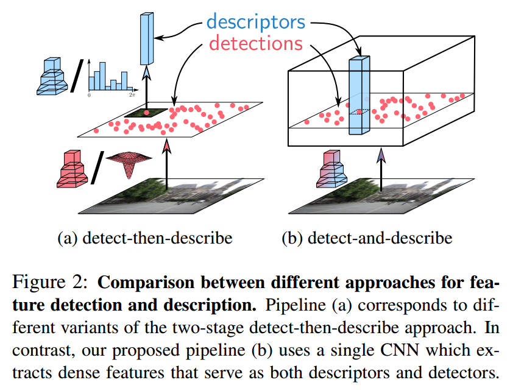
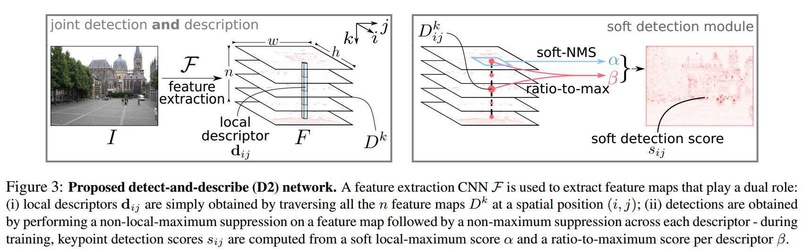
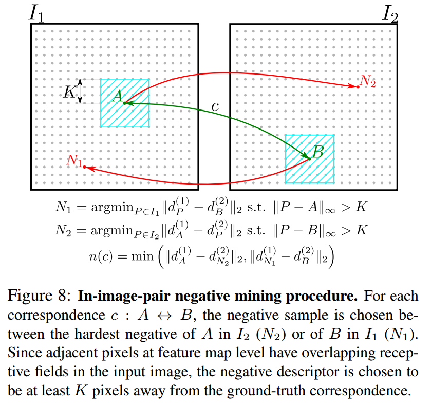
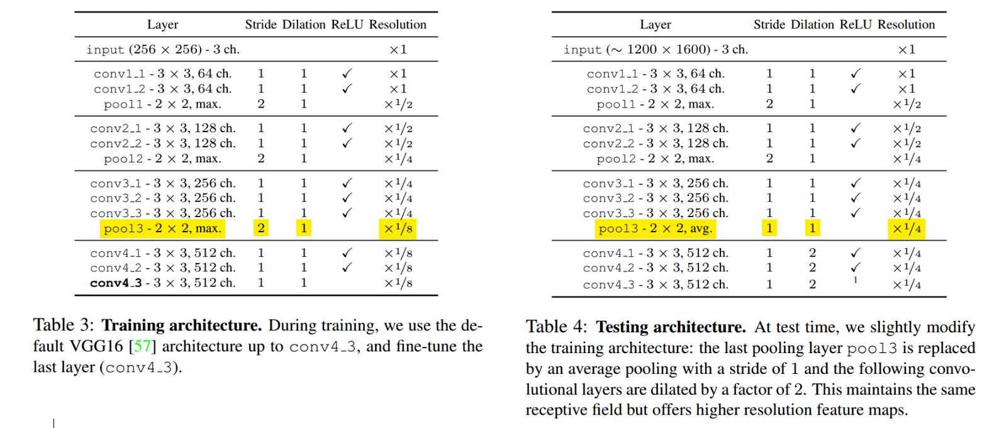
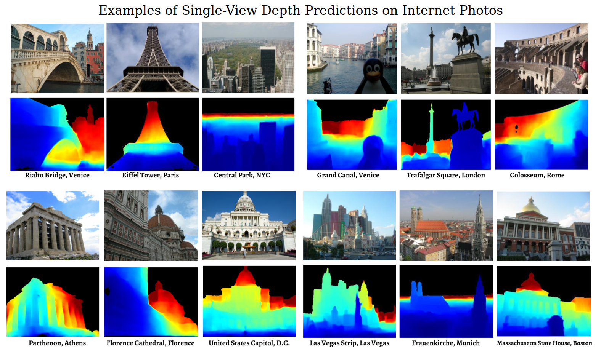
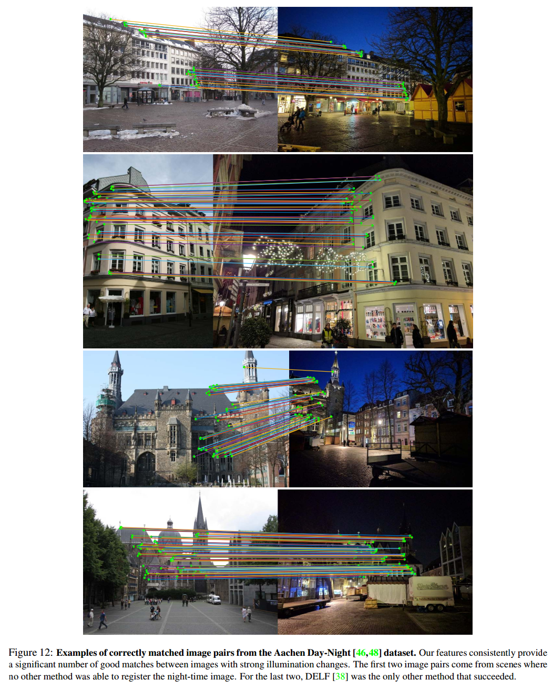
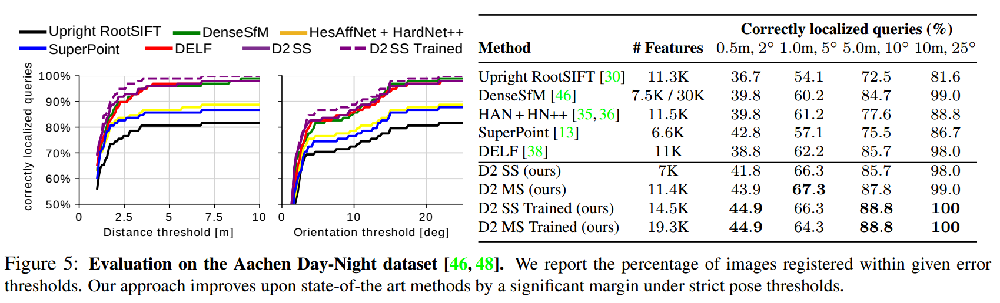

---
jupyter:
  jupytext:
    text_representation:
      extension: .Rmd
      format_name: rmarkdown
      format_version: '1.2'
      jupytext_version: 1.11.2
  kernelspec:
    display_name: Python 3
    language: python
    name: python3
---

# Week07: Deep Image Registration
#### Besed on lecture given by: Axel Schaffland

## Content
(can be completed in the end)

<!-- #region -->
## 3. Deep features: Detect-and-Describe

The central idea of [D-2 Net paper](https://arxiv.org/abs/1905.03561) is to first use CNN to compute a set of feature maps, which are then used to compute the descriptors (as slices through all maps at a specific pixel position) and to detect keypoints (as local maxima of the feature maps). 

In contrast, the previous method - *detect-then-describe* - first applies a feature detector to identify a set of keypoints, which then provides image patches extracted around the keypoints for feature description. According to [Dusmanu and colleagues](https://arxiv.org/abs/1905.03561), the limitation of *detect-then-describe* is that the lack of repeatability in the keypoint detector: While local descriptors consider larger patches and potentially encode higher-level structures, the keypoint detector only considers small image regions. As a result, the detections are unstable under strong appearance changes. This is due to the fact that the low-level information used by the detectors is often significantly more affected by changes in lowlevel image statistics such as pixel intensities.

<td>  </td> 

<!-- #endregion -->

### Discussion during previous meeting: Neural Networks are used to obtain deep features (instead of classical features). Then traditional methods are used to match features on paired images.

<!-- #region -->
### 3.1 Joint Detection and Description Pipeline

The *detect-and-describe* proposes a joint detection and description pipeline (as opposed to two-stage pipeline in *detect-then-describe*). In other words, all parameters are shared between detection and description and a joint formulation that simultaneously optimizes for both tasks is used. Because both detector and descriptor share the underlying representation, this approach is referred to as D2.

<td>  </td> 

Before feature description and detection, **the fist step** in the pipeline is to apply a CNN F on the input image $I$ to obtain a 3D tensor $F$ = F($I$ ); $F$ belongs to Rh×w×n, where h×w is the spatial resolution of the feature maps and n the number of channels.

<!-- #endregion -->

#### 3.1.1 Feature Description

#### 3.1.2 Feature Detection

**Hard Feature Detection**

**Soft Feature Detection**

### 3.2 Jointly Optimizing Detection and Description

#### 3.2.1 Training Loss

<td>  </td> 

#### 3.2.2 Stride and dilation for testing
explain dilation briefly

#### 3.2.3 Scale invariance

#### 3.2.4 Subpixel accuracy

### 3.3 Network Architecture

The VGG16 architecture, pretrained on ImageNet and truncated after the conv4 3 layer, was used
to initialize the feature extraction network $F$.

<td>  </td> 

As highlighted in yellow, at test time, in order to increase the resolution of the feature maps, the last pooling layer (pool3) from $F$ with a stride of 2 is replaced by an average pooling layer with a stride of 1.

Then, the subsequent convolutional layers (conv4 1 to conv4 3) are replaced with dilated convolutions with a rate of 2, so that their receptive field remains unchanged. With these modifications, the obtained feature maps have a resolution of one fourth of the input resolution, which allows for more tentative keypoints and a better localization.

### 3.4 Dataset - MegaDepth Dataset 

To generate training data on the level of pixel-wise correspondences, [the MegaDepth dataset](https://www.cs.cornell.edu/projects/megadepth/) is used, which consists of 196 different scenes reconstructed from 1,070,468 internet photos using COLMAP.

Here is an example of the MegaDepth Dataset. (The images at the bottom row are heat-maps, indicating the distance to the camera. Black is sky and the value is infinite.)

<td>  </td> 

### 3.5 Results of D2-Net

Here are examples of correctly matched image pairs from the [Aachen Day-Night dataset](https://www.visuallocalization.net/datasets/) by D2-Net method:

<td>  </td> 

Below is an evaluation on the Aachen Day-Night dataset. On the $X$-axis, the distance threshold and orientation threshold refer to how far off the model's predictions are from the actual camera position/angle.

<td>  </td> 

### Conclusion/Take-home message
Trend we have observed from previous topics to this one, Multistage models to a single-stage model.

