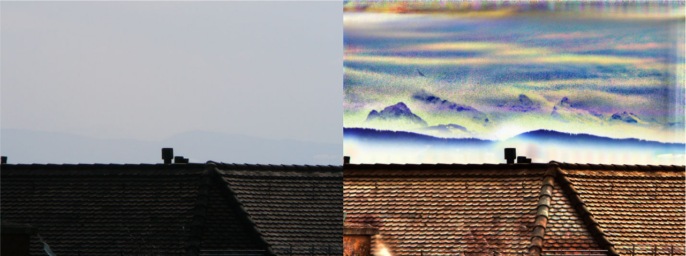
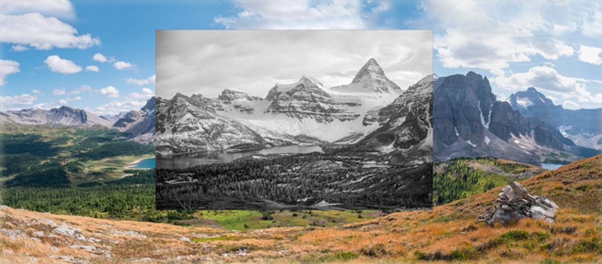
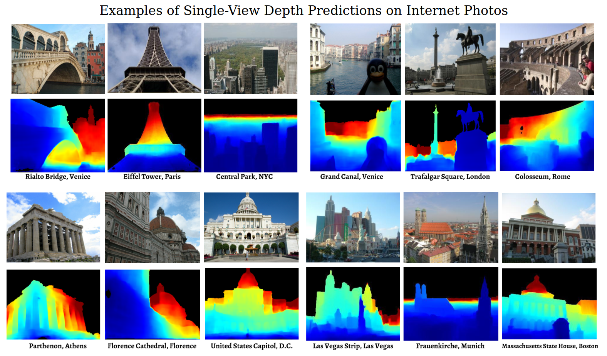

---
jupyter:
  jupytext:
    text_representation:
      extension: .Rmd
      format_name: rmarkdown
      format_version: '1.2'
      jupytext_version: 1.11.2
  kernelspec:
    display_name: Python 3
    language: python
    name: python3
---

# Week07: Deep Image Registration
#### Besed on lecture given by: Axel Schaffland

## Content
- [What is Image Registration?](#What-is-Image-Registration?)
- [Global vs Local Transformations](#Global-vs-Local-Transformations)
- [Approach 1: Estimating the Transformation Matrix](#Approach-1:-Estimating-the-Transformation-Matrix)
- [Approach 2: Iterative Registration](#Approach-2:-Iterative-Registration)
- [Approach 3: Deep features: Detect-and-Describe](#Approach-3:-Deep-features:-Detect-and-Describe)

So far we have covered the history of deep architectures for image classification tasks, how neural architectures can be designed. We learned about how classification losses can be derived and understood and how in Similarity Learning, the objective is framed differently, in that we want to push related feature embeddings closer together and (supposedly) unrelated embeddings further apart. We went on to learn about how the task of Object Detection can be framed. 

In this chapter, we will go on to learn about yet another topic in deep learning, which is image registration. We first define the problem faced in Image Registration, which tasks we are concerned with in Image Registration and introduce the concept of transformation matrices. We will go on to examine three different approaches to Image Registration in historical order: 

- Transformation matrix estimation, 
- Iterative Registration
- Joint Detection and Description with Deep Features

## What is Image Registration?

In an Image Registration task, we want to **align images** that are taken from **different perspectives** or have **different distortions**. We generally assume that we have at least two images that depict the same objects or the same scene.

We will now give and explain some example use-cases of such an alignment of images:

<!-- #region -->
- In HDR (High Dynamic Range) photography, we're interested in increasing the dynamic range (i.e. the brightness steps) of an image by combining multiple images taken with a different aperture. Details that are blown out due to overexposure in one image can be exposed just correctly in another image. Combining these images can help having an equal amount of detail in shadows as well as close to light sources and reflections. To utilize this idea, the images must first be aligned, because we don't usually have a static scene and camera.

- In Focus stacking we want to combine images with different focuses to obtain an image in which the depth of field is maximal and everything is in focus. For this too, we need to have the images aligned.

- Similarly to stacking focus, we can use multiple images to increase the signal to noise ratio in an image (i.e. make invisible structure visible by combining multiple signals).

- In Medical imaging (e.g. MRI), images need to be aligned to facilitate comparison between different subjects or between different images of the same subject at different times.

- In panorama or 360° photography, we want to stack images taken from different angles and positions to obtain a seamless image covering a larger area. An example of this is Google Maps' Street View. We also call this process Image Stitching

- In repeat photography, we want to align historical images with contemporary images to compare how a place has changed throughout history.

- Scene reconstruction is a bit different from the previous examples in that we don't align a taken image with another image but a 3D scene with an image.

- In Motion tracking, we again have a non-static scene (objects depicted and/or camera) and estimate how much and in which direction objects or the camera have been moved. This is utilized in making actors control the movement of creatures that are rendered with some 3D software.

- Stabilizing a video taken by a non-static camera can also be interpreted as aligning images. 
  

We see that the use of image registration techniques is already pretty common (even without VR and AR technologies playing a central role in our lives).

But how do we actually align images?
<!-- #endregion -->

<!-- #region -->
## Global vs Local Transformations
Imagine yourself with two images each taken from a different perspective. One of them lays infront of you on a table the other one you hold with both of your hands. Lets also say that the image in your hands is somewhat transparent to make it easier. How would you align the image in your hands to the image on the table?
 

The first thing you might do is move the image roughly above the image on the table so that their positions somewhat match up. 
If we abstract our image into the realm of mathematics then we can think of the image as in a 2d space 
and we can interpret its movement as a shift along the x or y-axis.  
To achieve these kind of shifts we shift the whole 2d space and with it will go the image as a subset of this space. To transform our 2d space in general we can use our favourite thing, matrices. 
If you are unsure about why matrices represent transformations we recommend [this video](https://www.youtube.com/watch?v=kYB8IZa5AuE).  
The thing is that matrices will only transform our space linearly, meaning the origin will stay fixed and parallel lines will remain parallel. Parallel lines staying parallel sounds good, but to achieve a shift we will also have to move the origin. 

To adress this issue we can  switch to affine transformations 
You can think of affine transformations as doing a linear transformation but then adding a vector on top.
 

$$f(x) = Ax + b$$
 

$$\begin{pmatrix}5\\3\end{pmatrix} = \begin{bmatrix}2 & 0 \\ 0 & 2\end{bmatrix} \centerdot \begin{pmatrix}2\\1\end{pmatrix} + \begin{pmatrix}1\\1\end{pmatrix}$$

So we can transform our image linearly with *matrix* $A$ and also shift it along the x or y-axis with *vector* $b$. 
*To get the name of the transformations hover over the gifs*

For our hands on example that means we can now roughly match the positions by shifting the image and we can also do everything that keeps parallel lines parallel, think of the edges staying parallel. 
So for example we can rotate our image or squeeze or stretch it from opposing sides, given that the material allows for it. 
*The blue grid represents the old space without a transformation applied*
<table><tr>
<td>  </td>
<td>  </td>
<td>  </td> 
<td>  </td> 
</tr></table>
 

Now the question arises, is there anything that we can with the image in our hands that is not described by affine transformations. 
And the answer is yes. We can for example tilt the image to the right. From a 2d point of view, the left side of the image grows larger while the right side gets smaller. This kind of transformation cannot be expressed by an affine transformation in two dimensions.  

If we also want to mathematically express tilts without bothering with any more complex transformations we can just switch to 3 dimensions. In 3d a tilt is nothing but a rotation.  
Going 3d has another benefit. If you look at top side of the sheared square you can see how it is shifting. So what what if we shear a cube in 3d and imagine the top side as our image ... *drumroll*... We just shifted/translated our image with a **linear** transformation without having to add any vector.

 

So in essence, if we go 3 dimensional and place our image at $z=1$ (top of square) then we can achieve  
affine and projective (tilting) transformations from a 2 dimensional perspective with just linear transformations (simple matrix). 
(*"from a 2 dimensional perspective"* ~ meaning we project our image back to 2 dimensions after the transformation)
 
 

If you want further illustrations you can check out [this video](https://www.youtube.com/watch?v=E3Phj6J287o)
 

Below is some math to elaborate how we "go" into 3d and thus integrate the "added vector" into the matrix

$$\mathbf{y} = A \mathbf{x} + \mathbf{b}$$

$$\begin{bmatrix} \mathbf{y} \\ 1 \end{bmatrix}
= \left[ \begin{array}{ccc|c} & A & & \mathbf{b} \\ 0 & \cdots & 0 & 1 \end{array} \right]
\begin{bmatrix} \mathbf{x} \\ 1 \end{bmatrix}$$

Coming back to the title of this section, **Global vs Local Transformations**, everything we did so far we applied to the whole image or in fact to the whole 2d plane. This is why we call all these transformations **Global**.  
In **Rigid Registration** we assume that we can align images with a Global transformation.

This stands in contrast to **Non-Rigid Image Registration** where assume that a **local** distortion has taken place. This might be useful for un-distorting pictures taken with a lens that has a distortion, but in this chapter we will focus enterily on **Rigid Image Registration**.

### With all this linear algebra out of the way we can finally jump into the first approach.
*note for finalize group: if any animations need changing contact us*
<!-- #endregion -->

<!-- #region -->
# Approach 1: Estimating the Transformation Matrix

This approach is all about using a Single Layer Neural Network (SL-NN) to predict **parameters** of **affine transformations** in 2 dimensions. 
Because we restrict ourselves to affine transformations that also means that we assume that the planar object that we want to align is not tilted like we saw in the previous gif.

$$A = \begin{bmatrix}a_{11} & a_{21} \\ a_{12} & a_{22}\end{bmatrix} \quad and \quad b = \begin{pmatrix}b_1\\b_2\end{pmatrix}$$

The prediction is based on image coordinates of the points in a transformed view or perspective. 
Note that we dont give the network any information about the original view of our planar object. If you are now wondering how the network would then be able to predict the affine transformation that would align two yet unseen images, then you are right to wonder, because in this approach we always train with the same original image that is then transformed into many new views from which the network has to predict the respective transformations. 

After training the network should be able to generalize, that is predict the parameters of the transformation for an image in an unknown view.

### Procedure
The first thing we do is choose a model, but not model as in neural network but as in mould or object.
This model represents our original image from which we generate new views.

Before we generate new views based on affine transformations we define the possible ranges of values for the parameters that constitute the transformation.

In the next step we sample affine transformations according to the previously defined parameter ranges. These transformations will then be applied to the known view, our original image or model. The result are transformed views which are then used to train the Single Layer Neural Network.

The input is not the transformed images themselves but coordinates of points in the transformed images. Points like the *int_points* in the illustration above.

The loss is calculated based on the predicted and true parameters using the sum of squared errors

One important detail about the architecture is that they split the coordinates of the transformed points into x and y values which reduced the time to generate the transformed views significantly and also reduced the network size by half. *(This was in 1999, when hardware limitation were still a concern)*

### PCA
Principle component analysis is applied to the inputs of the network in order to reduce the dimensionality.

### Testing
To test the models performance they compared the outputed transformation parameters directly to the true parameters and also compared the original image with the true transformation applied to the original image with the predicted transformation applied.
<!-- #endregion -->
<!-- #region -->
# Approach 2: Iterative Registration

The approach of estimating the Transformation Matrix isn't easily applicable to the real world because normally the input data for image registration problems are images rather than the point pairs. To be able to work directly with images other approaches are needed. One such approach utilizes Deep Reinforcement Learning and is called Iterative Registration.

The idea behind this approach is to train an artificial agent to mimick how a human expert would solve the problem of aligning images. This changes the problem from a regression task to a classification task in which the agent chooses one action at a time to iteratively align the images, hence the name of this approach.

## Recovering the transformation matrix for medical images

The approach was first used in a medical context and opperated on 3-dimensional imaging data. The dataset consisted of single medical images. To get an image pair and an associated from these images, randomly generated transformation matrices were applied to each image, augmenting the dataset and creating a ground truth. The agent should then learn to transform the augmented image back to the original one by iteratively applying transformations that it assumes will lead to the highest return.

The actions the agent can take are:
- positive rotation around x, y and z axis
- negative rotation around x, y and z axis
- positive translation in x, y and z direction
- negative translation in x, y and z direction

The neural network is trained to find the action that would minimize the distance to the true transformation matrix, which would yield the highest reward.

## Defining the reward

The reward is defined as the difference between the L2 norm distance between the true transformation matrix and the previous "aggregated" transformation matrix and its successor after applying the most recent action. 

$$ r(s_t, a_t) =  D(T_g, T_t) - D(T_g, a_t \circ T_t)$$

Additionally there is a bonus reward of 10 for reaching a distance smaller than 0.5 to the ground truth transformation matrix $T_g$.

## Supervised loss function

Instead of using a standard loss used in Deep Q-Learning, this method uses a loss that is closer to supervised learning. This comes with some advantages that are necessary to deal with high dimensional volumetric imaging data and it is possible because the target Q-values (expected return for taking an action) can just be evaluated analytically. So different from standard Reinforcement Learning, this method does not require sampling full trajectories to obtain state-action value targets.

## Model architecture

The network that was used for this approach had 5 convolutional layers followed by 3 fully connected layers and 12 output neurons one for each possible action.
<!-- #endregion -->

# Approach 3: Deep features: Detect-and-Describe

From object detection lectures, we learned that for models in the R-CNN family, the detection consists of two stages: (1) first, the model proposes a set of regions of interests by selecting search or regional proposal network. The proposed regions are sparse as the potential bounding box candidates can be infinite. (2) Then a classifier only processes the region candidates ([Lil'log](https://lilianweng.github.io/lil-log/2018/12/27/object-detection-part-4.html)).

Similarly, *detect-then-describe* method first applies a feature detector to identify a set of keypoints, which then provides image patches extracted around the keypoints for feature description. 

According to [Dusmanu and colleagues](https://arxiv.org/abs/1905.03561), the limitation of *detect-then-describe* is the lack of repeatability in the keypoint detector: while local descriptors consider larger patches and potentially encode higher-level structures, the keypoint detector only considers small image regions. As a result, the detections are unstable under strong appearance changes. This is due to the fact that the low-level information used by the detectors is often significantly more affected by changes in lowlevel image statistics such as pixel intensities.

This motivates the work of *detect-**and**-describe* as introduced in the [D-2 Net paper](https://arxiv.org/abs/1905.03561). 

<td>  </td> 

The central idea is to first use CNN to compute a set of feature maps, which are then used to compute the descriptors (as slices through all maps at a specific pixel position) and to detect keypoints (as local maxima of the feature maps). Unlike approach 1 and 2 whose goal is to learn the underlying transformation matrix, the task here is to establish pixel-level correspondences.

<!-- #region -->
### 3.1 Joint Detection and Description Pipeline

The ***detect-and-describe*** proposes a joint detection and description pipeline (as opposed to two-stage pipeline in *detect-then-describe*). In other words, all parameters are shared between detection and description and a joint formulation that simultaneously optimizes for both tasks is used. Because both detector and descriptor share the underlying representation, this approach is referred to as D2.

<td>  </td> 

Before feature description and detection, **the fist step** in the pipeline is to apply a feature extraction CNN $\mathcal{F}$ on the input image $I$  
to obtain a 3D tensor $F$ = $\mathcal{F}($I$)$; $F$ $\in$ $\mathbb{R}^{h×w×n}$, where $h×w$ is the spatial resolution of the feature maps and $n$ the number of channels. 

In the context of ***feature description***, the 3D tensor $F$ could be interpreted as a dense set of descriptor vectors $\mathbf{d}$. As indicated above in Figure 2 (b) and Figure 3 - left image, each $\mathbf{d}$ is the **blue bar** at each $ixj$ position/pixel across all channels. The mathematical definition of $\mathbf{d}$ is $\mathbf{d}_{ij} = F_{ij:}, \mathbf{d} \in \mathbb{R}^{n} (i = 1,...,h; j = 1,...,w)$.

After L2 normalization, these descriptor vectors could be readily compared between images to establish correspondences using Euclidean distance. ($\mathbf{\hat{d}}_{ij} = \mathbf{d}_{ij}/\lVert d \rVert_2$) 
<!-- #endregion -->

#### 3.1.1 Feature Detection

After knowing what the feature descriptors are, we would like to know how ***feature detection*** works. 

Through the lense of feature detection, the 3D tensor $F$ could be interpreted as a collection of 2D responses $D$: $$D^{k} = F_{::k}, D^{k} \in \mathbb{R}^{hxw} (k = 1, ..., n)$$ 

The feature extraction function $\mathbb{F}$ could be thought of as $n$ different feature detector functions $D^{k}$, each producing a 2D feature map (or detection map as named in the original paper) $D^{k}$. In Figure 3 - left image, $D^{k}$ is pointed out. A detection can take place on any of the response maps. 

If only a subset of locations are selected as the output keypoints, what are the restrictions to detect a point $(i, j)$?

**Hard Feature Detection**

In plain words, for a point $(i,j)$ to be detected, we first look at $(i,j)$ position across all channels(i.e. the blue bar) to identify the max $D_{ij}$ at the channel $k$ (i.e. $D^{k}_{ij}$). This is called ***channel selection*** in the original paper. Then we need to check if $D^{k}_{ij}$ is also the max compared to its nearest neighbors (i.e. ***local maximum***; 9 neighbors of pixel $(i,j)$ are used in the original paper). 

In other words, if $D^{k}_{ij}$ fullfils the criteria in both $hxw$ direction and channel direction then the according pixel (i,j) will be a keypoint. If the criteria are not met, then the pixel will not be a keypoint.
So it is either or which is why we talk about **hard** feature detection.

However, the hard features don't allow back-propagation for training. Therefore, as the next step, the hard detection procedures is softened to enable back-propagation.

**Soft Feature Detection**

The goal here is to additionaly generate a soft detection score $s_{ij}$ for training.

Step 1: compute a soft local-max. score $\alpha$ (i.e **soft-NMS** in Figure 3 - right image):
$$\alpha_{i j}^{k}=\frac{\exp \left(D_{i j}^{k}\right)}{\sum_{\left(i^{\prime}, j^{\prime}\right) \in \mathcal{N}(i, j)} \exp \left(D_{i^{\prime} j^{\prime}}^{k}\right)}$$

where $\mathcal{N}(i, j)$ is the set of 9 neighbours of the pixel $(i; j)$ (including itself).

Step 2: define soft channel selection that gives ratio-to-max score $\beta$:
$$\beta_{ij}^{k}=D_{ij}^{k} / \max {t} D_{ij}^{t}$$

Step 3: to take both criteria into account, we maximize the product of both scores across all feature maps k to
obtain a single score map:
$$\gamma_{ij}=\max_{k}\left(\alpha_{ij}^{k} \beta_{ij}^{k}\right)$$

Step 4: finally, the soft detection score $s_{ij}$ at a pixel $(i,j)$ is obtained by performing an image-level normalization:
$$s_{ij}=\gamma_{ij} / \sum_{\left(i^{\prime}, j^{\prime}\right)} \gamma{i^{\prime} j^{\prime}}$$

#### 3.1.2 Scale invariance - Image Pyramid (during *test time*)
Although CNN descriptors have a certain degree of scale invariance due to pre-training with data augmentations, they *are not* inherently invariant to scale changes and the matching tends to fail in cases with a significant difference in viewpoint.

An image pyramid is proposed to be used during testing. 

Briefly speaking, given an input image $I$, three different resolutions (half resolution, input resolution, and double resolution) is applied to $I$ and feature maps at those three resolutions are extracted using those three variants of $I$.

Since the intuition is also introduced in object detection, we recommend you to check out the paper for the exact operations.

#### 3.1.3 Subpixel accuracy

This has little to do with deep learning. For details, we would like to recommend you to check out the original paper.

### 3.2 Jointly Optimizing Detection and Description

#### 3.2.1 Training Loss

To jointly optimizes the detection and description objectives using a single CNN $\mathcal{F}$, we need an appropriate loss $\mathcal{L}$.

The loss $\mathcal{L}$ needs to address the following two objectives: 
1. for detection, we want keypoints to be repeatable under changes in viewpoint or illumination.  
2. for description, we want descriptors to be distinctive, so that they are not mismatched. 

An extension of triplet margin ranking loss is used, which has two anchors and consider two directions (as opposed to one anchor and considering only one direction as we learned previously).

Suppose we have a pair of images $(I_1, I_2)$ and a correspondence $c : A \leftrightarrow B (A \in I_1, B \in I_2)$. The extended triplet margin ranking loss seeks to minimize the distance of the corresponding descriptors (ground truth) $\mathbf{\hat{d}}^{(1)}_{A}$ and $\mathbf{\hat{d}}^{(1)}_{B}$, while maximizing the distance to other confounding descriptors $\mathbf{\hat{d}}^{(1)}_{N_1}$ and $\mathbf{\hat{d}}^{(1)}_{N_2}$ in either images.

Using what we learned before, we could understand $\mathbf{\hat{d}}^{(1)}_{N_1}$ as the hardest negative case similar to $\mathbf{\hat{d}}^{(1)}_{A}$ and $\mathbf{\hat{d}}^{(1)}_{N_2}$ similar to $\mathbf{\hat{d}}^{(1)}_{B}$. One thing new is that they need to lie outside of a square local neighbourhood
of the correct correspondence:

$$N_{1}=\underset{P \in I_{1}}{\arg \min }\lVert \hat{\mathbf{d}}_{P}^{(1)}-\hat{\mathbf{d}}_{B}^{(2)}\rVert_{2} \text { s.t. }\lVert P-A \rVert_{\infty}>K$$

and similarly for $N_2$.

<td>  </td> 

Step 1: define ***positive* descriptor distance $p(c)$** between the
corresponding descriptors $\mathbf{\hat{d}}^{(1)}_{A}$ and $\mathbf{\hat{d}}^{(1)}_{B}$:

$$p(c)=\lVert\hat{\mathbf{d}}_{A}^{(1)}-\hat{\mathbf{d}}_{B}^{(2)}\rVert_{2}$$

Step 2: define ***negative* descriptor distance $p(c)$** which accounts for the most
confounding descriptor for either $\mathbf{\hat{d}}^{(1)}_{A}$ or $\mathbf{\hat{d}}^{(1)}_{B}$:

$$n(c)=\min \left(\lVert \hat{\mathbf{d}}_{A}^{(1)}-\hat{\mathbf{d}}_{N_{2}}^{(2)}\rVert{2},\lVert \hat{\mathbf{d}}_{N_{1}}^{(1)}-\hat{\mathbf{d}}_{B}^{(2)}\rVert_{2}\right)$$

Step 3: The ***triplet margin ranking loss*** for a margin $M$ can be then defined as:

$$m(c)=\max \left(0, M+p(c)^{2}-n(c)^{2}\right)$$

An intuitive way of understanding this loss: it seeks to enforce the distinctiveness of descriptors by penalizing any confounding descriptor that would lead to a wrong match assignment. 

Step 4: to ensure *repeatability* of detections, an detection term is added to the triplet margin ranking loss:

$$\mathcal{L}\left(I_{1}, I_{2}\right)=\sum_{c \in \mathcal{C}} \frac{s_{c}^{(1)} s_{c}^{(2)}}{\sum_{q \in \mathcal{C}} s_{q}^{(1)} s_{q}^{(2)}} m(c)$$

Here, $s_{c}^{(1)}$ and $s_{c}^{(2)}$ are the soft detection scores at points $A$ and $B$ in $I_1$ and $I_2$ respectively. $\mathcal{C}$ is the set of all correspondence between $I_1$ and $I_2$.

We could understand $\mathcal{L}$ as a weighted average of the margin terms $m$ over all matches based on their detection scores. Thus, in order for the loss to be minimized, the most distinctive correspondences (with a low margin term $m$) will get higher soft detection scores; descriptors that are not very distinctive (i.e. larger $m(c)$) are encouraged to have a smaller soft detection score.

### 3.3 Network Architecture

The VGG16 architecture, pretrained on ImageNet and truncated after the conv4 3 layer, was used
to initialize the feature extraction network $\mathcal{F}$.

<td>  </td> 

As highlighted in yellow, during testing, in order to increase the resolution of the feature maps, the last pooling layer (pool3) from $\mathcal{F}$ with a stride of 2 is replaced by an average pooling layer with a stride of 1.

Then the subsequent convolutional layers (conv4_1 to conv4_3) are replaced with **dilated convolutions with a rate of 2**, so that their receptive field remains unchanged. With these modifications, the obtained feature maps have a resolution of one fourth of the input resolution, which allows for more tentative keypoints and a better localization.

#### 3.3.1  Dilated Convolution
In dilated convolution we dilate or spread out our kernel to increase the receptive field without increasing our parameter count.
[Image Reference](https://arxiv.org/pdf/1603.07285.pdf)

### 3.4 Dataset - MegaDepth Dataset 

To generate training data on the level of pixel-wise correspondences, [the MegaDepth dataset](https://www.cs.cornell.edu/projects/megadepth/) is used, which consists of 196 different scenes reconstructed from 1,070,468 internet photos using COLMAP.

To extract the correspondences, the authors use depth information to obtain image pairs and key point correspondences for training.

Here is an example of the MegaDepth Dataset. 
(The images at the bottom row are depth maps, indicating the distance to the camera. Black is sky and the value is infinite.)

<td>  </td> 

### 3.5 Results of D2-Net

Here are examples of correctly matched image pairs from the [Aachen Day-Night dataset](https://www.visuallocalization.net/datasets/) by D2-Net method:

<td>  </td> 

Below is an evaluation on the Aachen Day-Night dataset. On the $X$-axis, the distance threshold and orientation threshold refer to how far off the model's predictions are from the actual camera position/angle.

<td>  </td> 

### Conclusion/Take-home message
From the previous lectures to the current one, we have observed the trend of using single-stage model instead of multistage models. The intuition behind improved performance is that the detection is not done on low-level image structures but postponed until more reliable information is available, and done jointly with the image description. 

